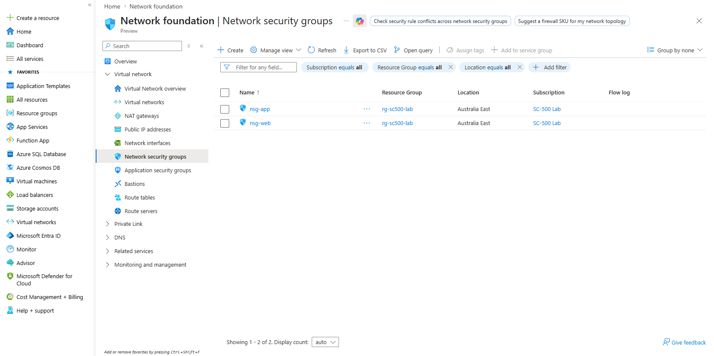
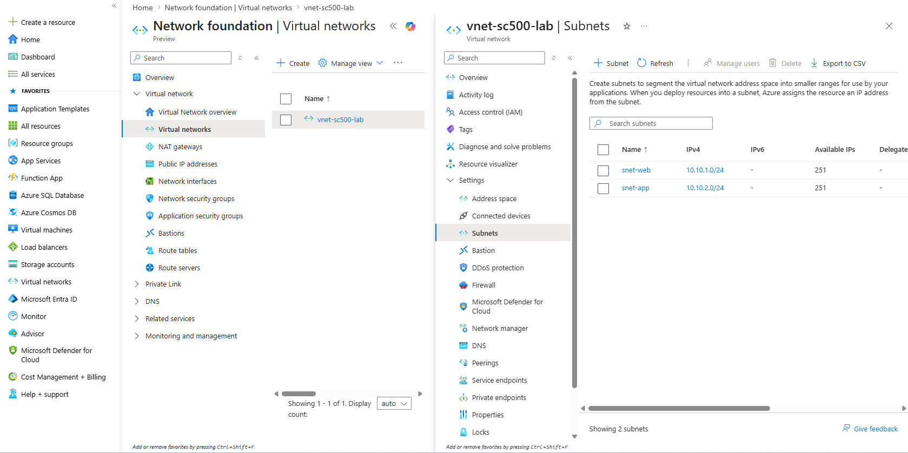
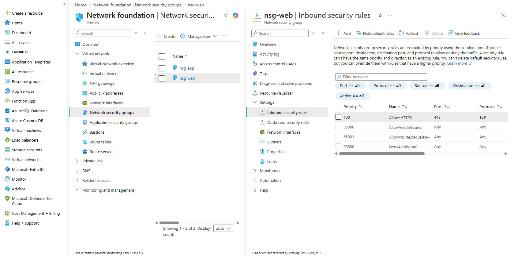
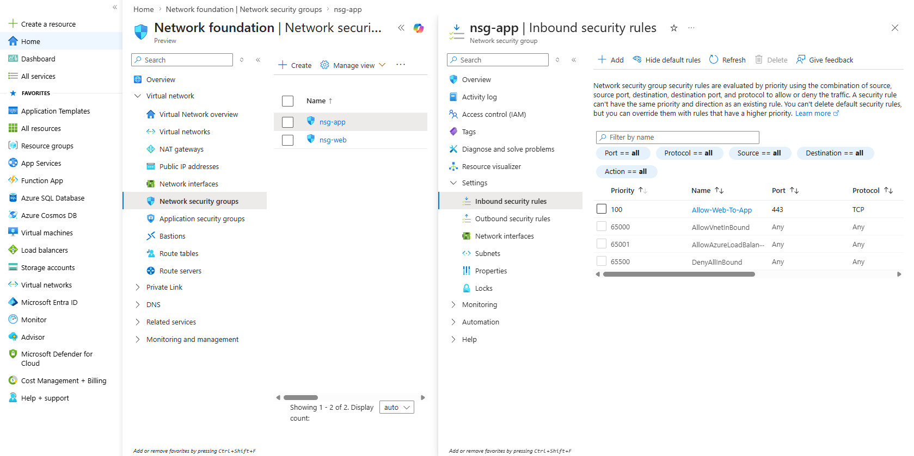
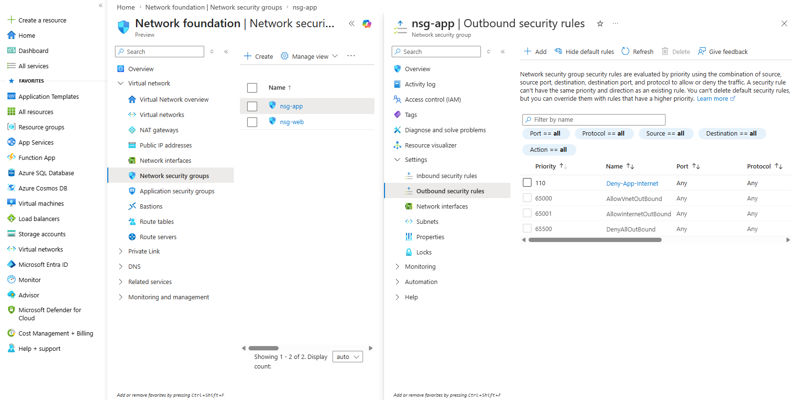

# Lab 01 – Azure Network Segmentation

## Objective
Build a segmented Azure network for web and application workloads.

## Resources Created
- Resource group: `rg-sc500-lab`
- Virtual network: `vnet-sc500-lab`
- Web subnet: `snet-web`
- App subnet: `snet-app`
- Web NSG: `nsg-web`
- App NSG: `nsg-app`

## Security Controls
- Allowed HTTPS inbound to the web subnet
- Allowed HTTPS from the web subnet to the app subnet
- Blocked outbound internet access from the app subnet
- Associated each NSG with the correct subnet

## What I Learned
- How VNets and subnets separate workloads
- How NSGs control inbound and outbound traffic
- How network segmentation reduces risk
- How least privilege applies to cloud networking

## Screenshots

### Network Security Groups

### Virtual Network Subnets

### Web NSG Inbound Rules

### App NSG Inbound Rules

### App NSG Outbound Rules

