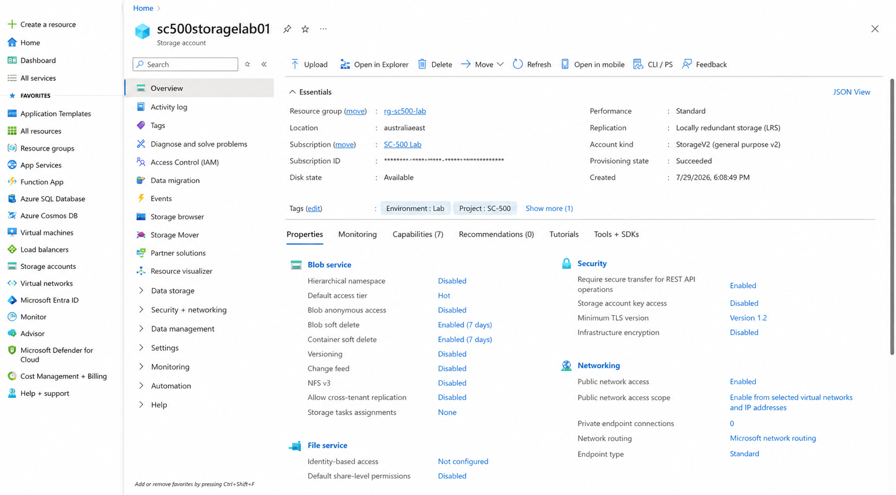
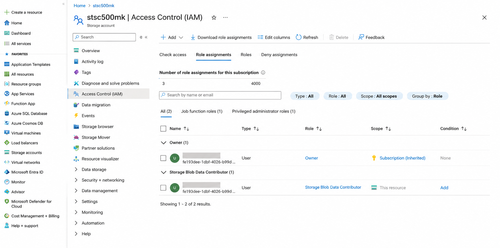
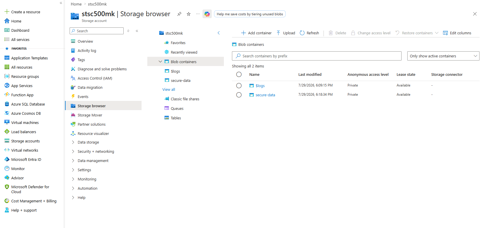
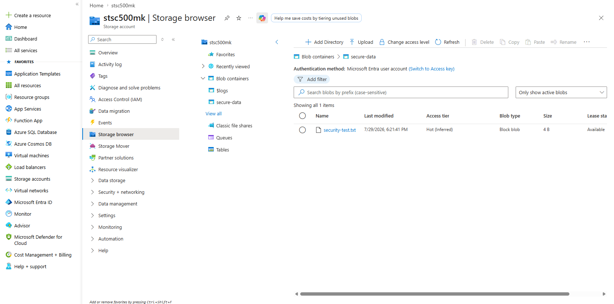
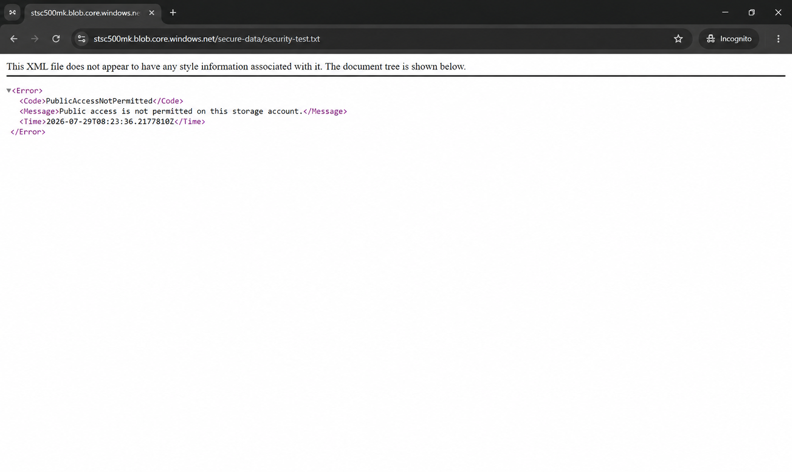

# Lab 03 – Azure Storage Security

## Objective

Secure an Azure Storage account using network restrictions, Microsoft Entra ID authentication, Azure RBAC, private blob access, and secure transfer settings.

## What I Configured

- Created a general-purpose v2 storage account
- Used locally redundant storage to minimise lab cost
- Restricted public network access to selected IP addresses
- Added my current client IP address
- Required secure transfer over HTTPS
- Enforced TLS 1.2
- Disabled anonymous blob access
- Disabled storage account key access
- Set Microsoft Entra ID as the preferred authorization method
- Enabled blob and container soft delete for 7 days
- Assigned the Storage Blob Data Contributor role
- Created a private blob container named `secure-data`
- Uploaded a test file using Microsoft Entra authentication
- Verified that anonymous public access was blocked

## Security Controls

- Identity-based access through Microsoft Entra ID
- Least-privilege data access through Azure RBAC
- Storage account keys disabled
- Anonymous access disabled
- Network access restricted by IP
- HTTPS required
- TLS 1.2 enforced
- Soft delete enabled for data recovery

## Validation

The test file was uploaded successfully using a Microsoft Entra user account.

When the blob URL was opened in an Incognito browser without authentication, Azure returned:

`PublicAccessNotPermitted`

This confirmed that anonymous access was blocked.

## What I Learned

- Azure management roles and storage data roles are separate
- The Owner role does not automatically provide blob data access
- Storage Blob Data Contributor provides access to blob data
- Microsoft Entra authentication is safer than shared account keys
- Network controls and identity controls should be used together
- Private containers prevent unauthenticated access
- Soft delete provides protection against accidental deletion

## Security Note

No account keys, SAS tokens, subscription IDs, personal account details, or sensitive file contents are included in this repository.

## Screenshots

### 1. Storage Account Security Overview

### 2. Storage Blob Data Contributor RBAC

### 3. Private Blob Container

### 4. Microsoft Entra Authenticated Upload

### 5. Public Access Blocked

