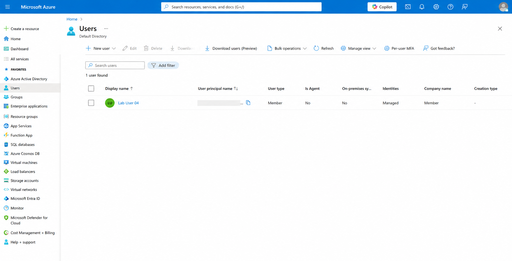
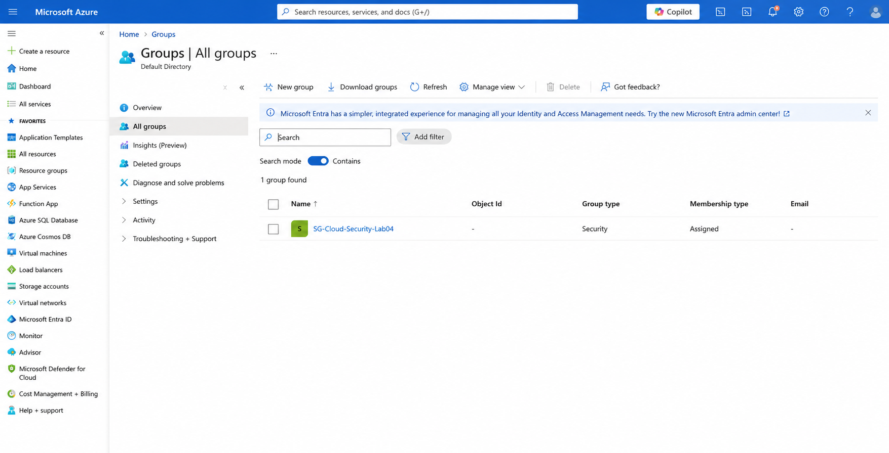
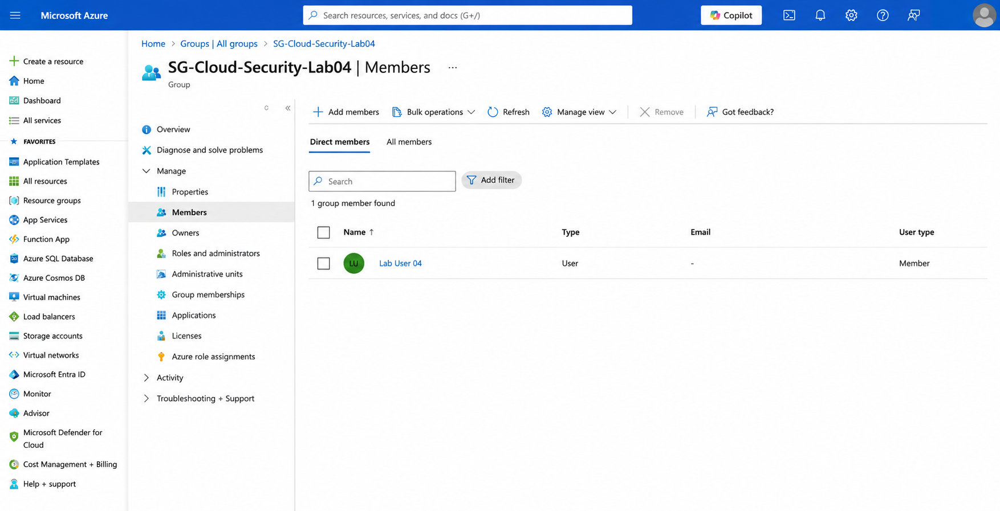
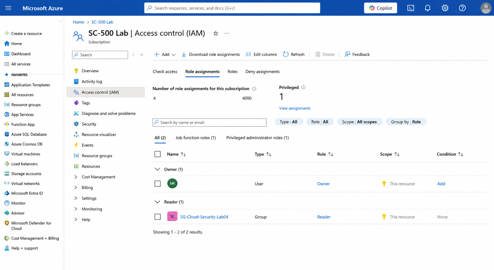
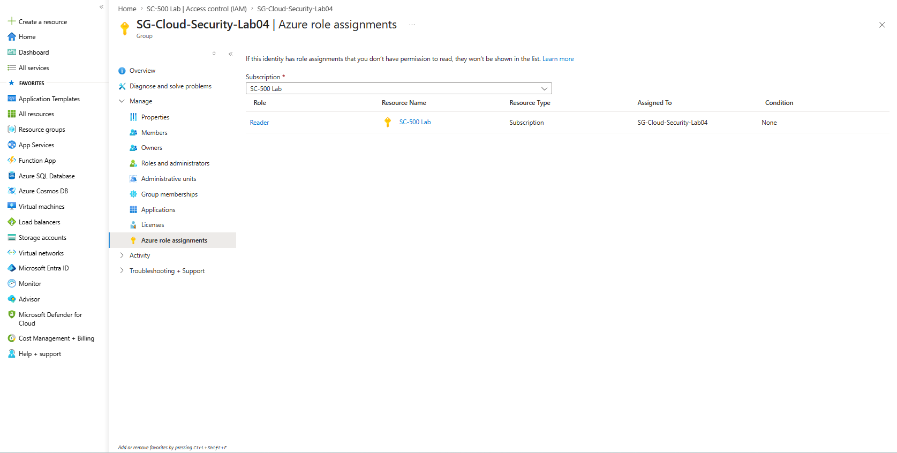

# Lab 04 – Microsoft Entra Users, Groups and Azure RBAC

## Objective

Create a Microsoft Entra test user and security group, then assign Azure access to the group using role-based access control.

## What I Configured

- Created a test user named `Lab User 04`
- Created a security group named `SG-Cloud-Security-Lab04`
- Used assigned group membership
- Added `Lab User 04` as a direct group member
- Assigned the Azure `Reader` role to the security group
- Applied the role at the subscription scope
- Confirmed the role assignment from both Azure IAM and the group view

## Security Controls

- Group-based access management
- Azure role-based access control
- Read-only subscription access
- Centralised permission assignment
- No direct Azure role assignment to the individual test user

## Validation

The `Reader` role was assigned to `SG-Cloud-Security-Lab04` at the `SC-500 Lab` subscription scope.

Because `Lab User 04` is a member of the group, the user receives read-only access through group membership.

## What I Learned

- Microsoft Entra groups can be used to manage access at scale
- Azure roles can be assigned to groups instead of individual users
- Group-based permissions simplify onboarding and offboarding
- The `Reader` role allows resource visibility without modification rights
- Azure RBAC assignments can be reviewed from both the resource and identity side
- Using groups is more manageable than assigning roles directly to each user

## Security Note

No passwords, object IDs, tenant details, personal account information, or sensitive identity information are included in this repository.

## Screenshots

### 1. Microsoft Entra Test User

### 2. Security Group Created

### 3. Group Membership

### 4. Reader Role Assigned to Group

### 5. Group Role Assignment Confirmation

