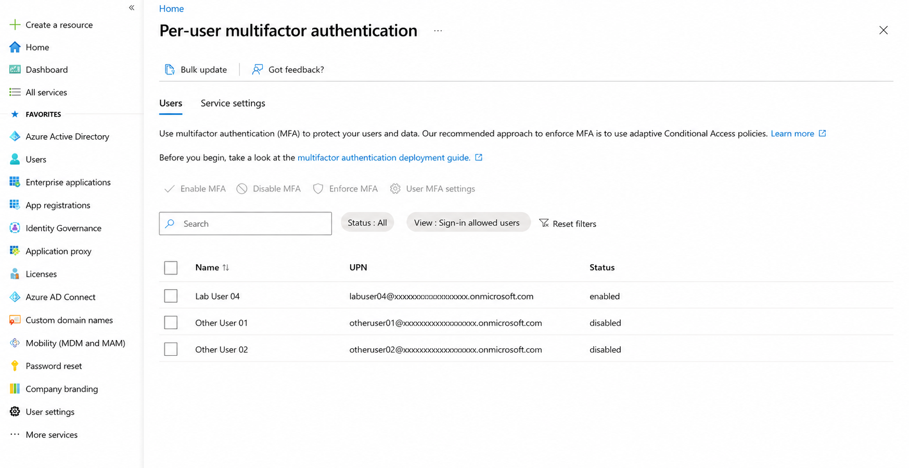
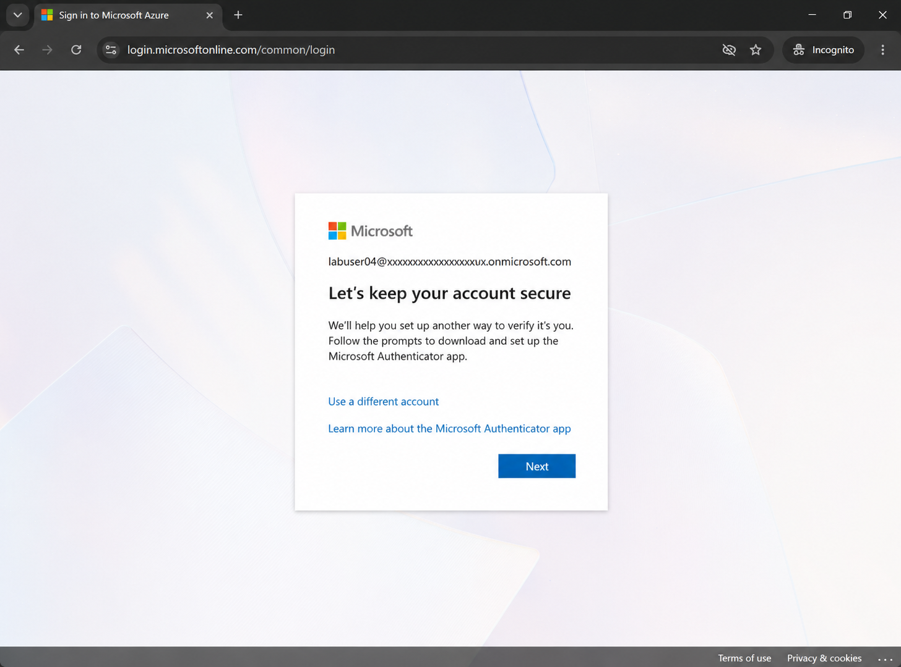
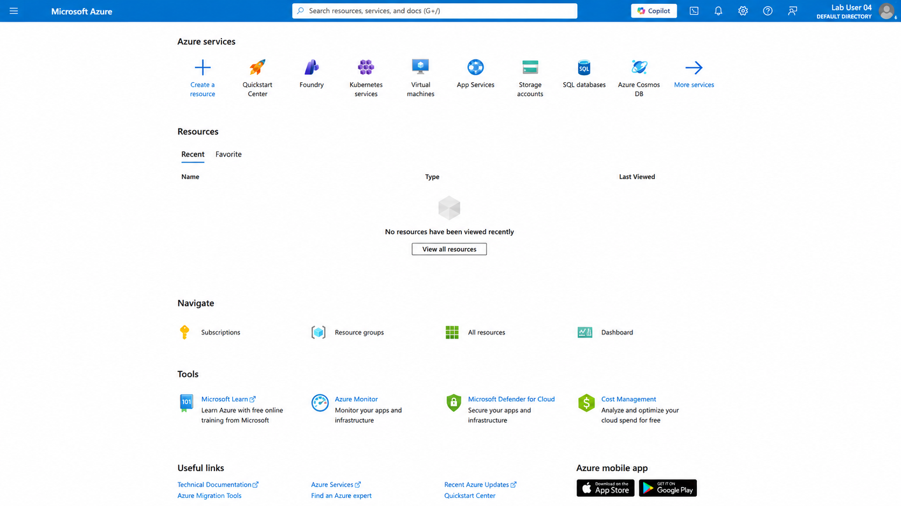
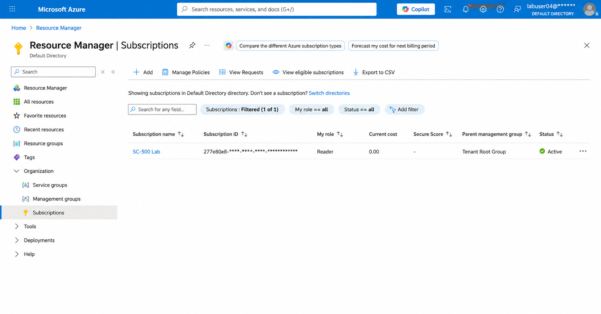
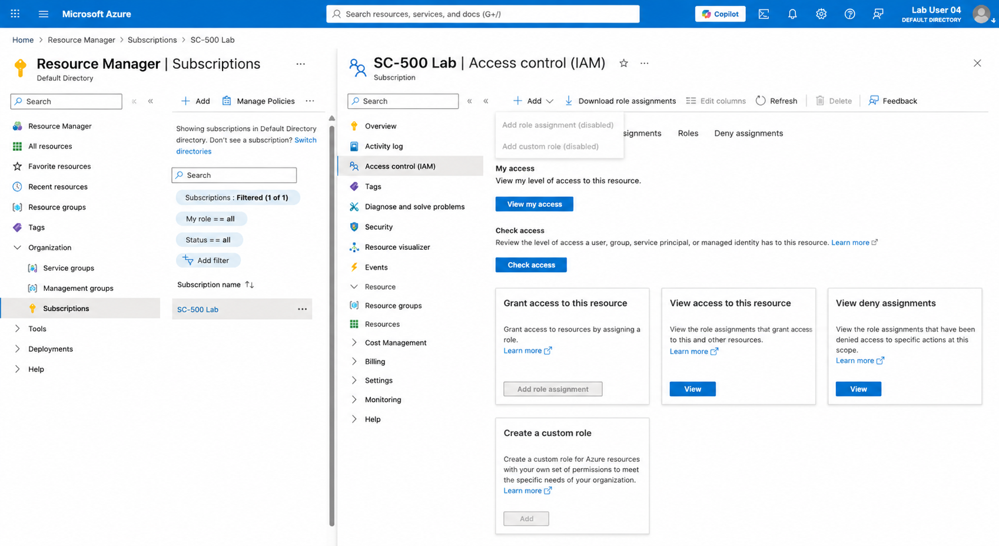

# Lab 05 – MFA and Reader Access Validation

## Objective

Enable multifactor authentication for a Microsoft Entra test user and validate that the user receives read-only Azure access through group-based RBAC.

## What I Configured

- Enabled per-user MFA for `Lab User 04`
- Signed in using the test account
- Changed the temporary password at first sign-in
- Registered Microsoft Authenticator
- Confirmed successful MFA-protected sign-in
- Verified access to the `SC-500 Lab` subscription
- Confirmed the user received the `Reader` role through group membership
- Tested that role assignments could not be created

## Security Controls

- Multifactor authentication
- Microsoft Authenticator registration
- Group-based Azure RBAC
- Least-privilege Reader access
- Separation between viewing resources and changing permissions

## Validation

`Lab User 04` successfully signed in after completing MFA registration.

The user could view the Azure subscription because the account inherited the `Reader` role through the security group.

When the user opened Access control (IAM), the option to add a role assignment was disabled. This confirmed that Reader access allowed visibility but did not permit access-management changes.

## What I Learned

- MFA adds an additional identity-verification step beyond a password
- Per-user MFA can be used in Microsoft Entra Free
- Conditional Access requires a higher Microsoft Entra licence
- Reader access allows users to view Azure resources without modifying them
- Group-based RBAC provides scalable access management
- Azure permission boundaries can be validated by testing blocked actions

## Security Note

No passwords, QR codes, authentication setup keys, phone numbers, tenant IDs, subscription IDs, or personal account details are included in this repository.

## Screenshots

### 1. Per-user MFA Enabled

### 2. MFA Registration Required

### 3. Successful MFA-Protected Sign-in

### 4. Reader Subscription Access

### 5. Role Assignment Blocked

