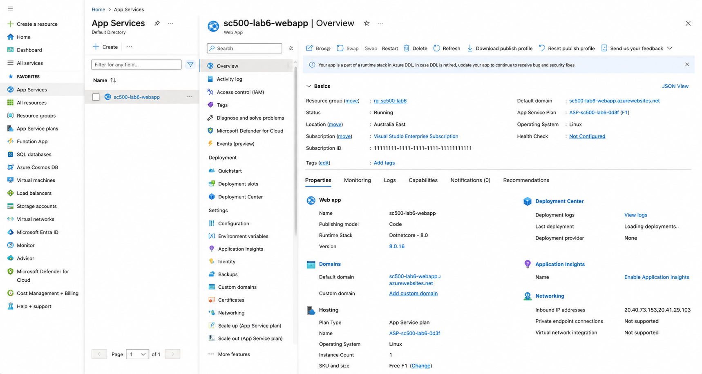
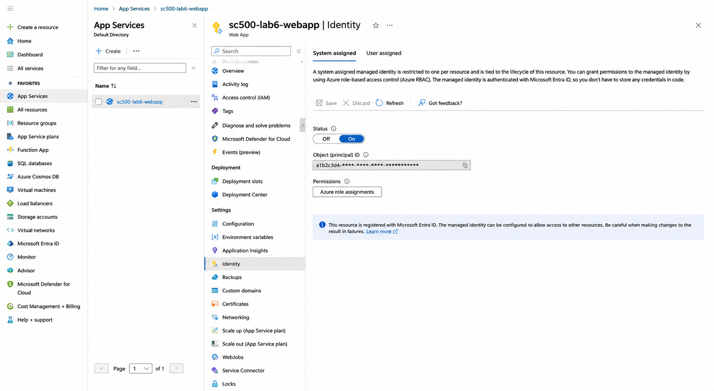
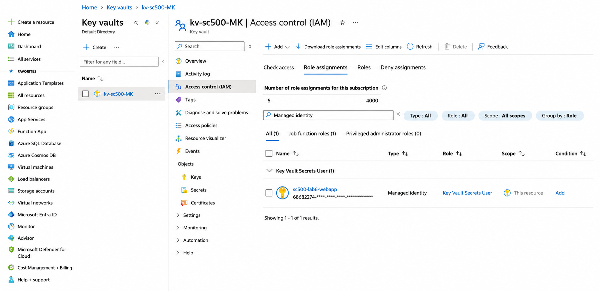
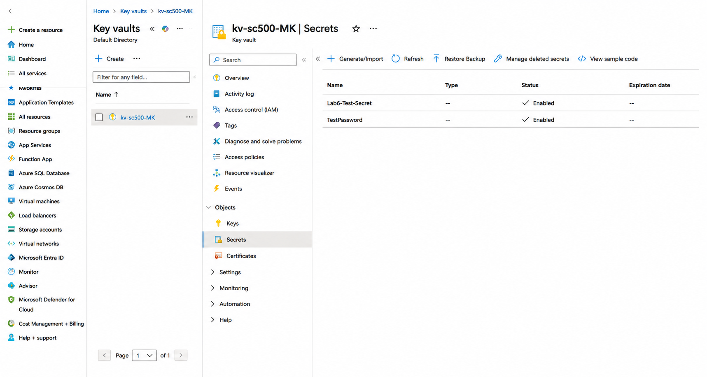
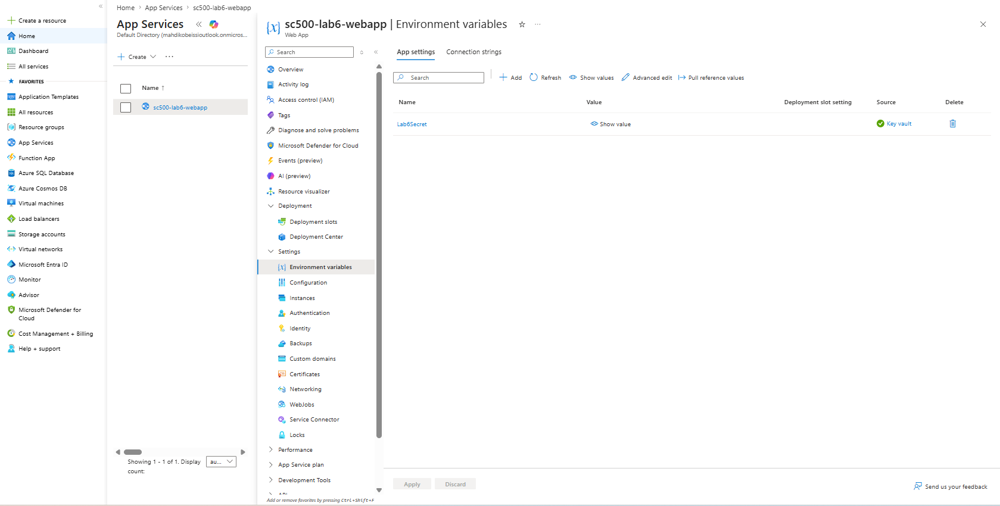

# Lab 06 – Managed Identity and Azure Key Vault

## Objective

Configure an Azure Web App to securely access a secret stored in Azure Key Vault without storing usernames, passwords, or application secrets.

## Resources Used

- Azure App Service
- System-assigned managed identity
- Microsoft Entra ID
- Azure Key Vault
- Azure RBAC

## What I Implemented

1. Created an Azure Web App named `sc500-lab6-webapp`.
2. Enabled its system-assigned managed identity.
3. Created a test secret in Azure Key Vault.
4. Assigned the Web App the `Key Vault Secrets User` RBAC role.
5. Added a Key Vault reference to the Web App environment variables.
6. Confirmed that the reference resolved successfully.

## Security Concept

The Web App uses its Azure-managed identity to authenticate to Key Vault.

No password or client secret is stored inside the application.

The `Key Vault Secrets User` role provides read access to secret values without allowing the Web App to create, modify, delete, or manage secrets.

This demonstrates:

- Passwordless service authentication
- Least-privilege access
- Secure secret storage
- Azure RBAC
- Managed identity integration

## Validation

The Key Vault reference displayed:

- `Source: Key vault`
- A green success indicator

This confirmed that the Web App identity had permission to retrieve the secret successfully.

## Screenshots

### 1. Web App Overview

### 2. Managed Identity Enabled

### 3. Key Vault Role Assignment

### 4. Test Secret Created

### 5. Key Vault Reference Success

## Outcome

The Azure Web App successfully accessed a Key Vault secret using its managed identity.

This removed the need to store permanent credentials in the Web App configuration.
