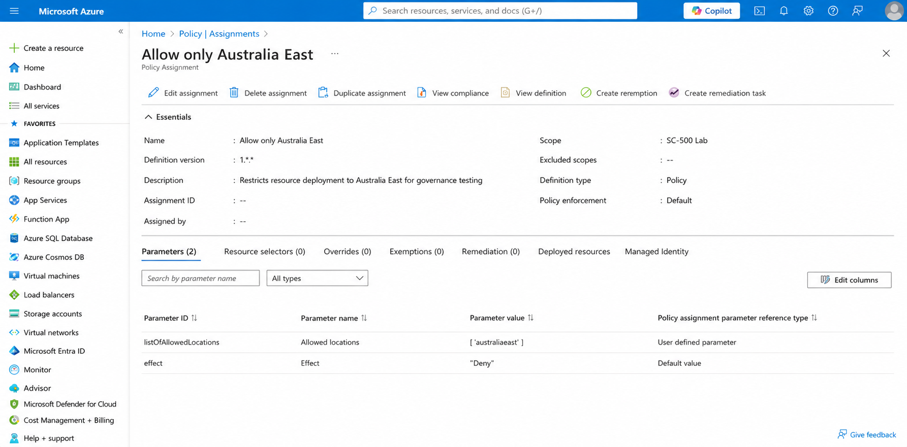
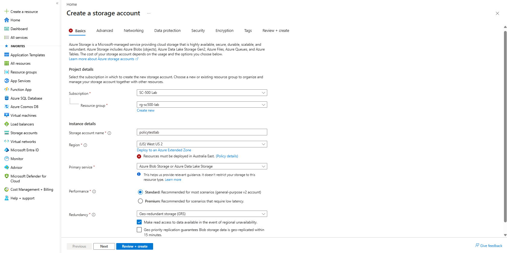

# Lab 07 – Azure Policy and Governance

## Objective

Use Azure Policy to enforce a governance rule that restricts resource deployment to an approved Azure region.

## Resources Used

- Azure Policy
- Azure subscription
- Azure Storage account deployment
- Azure governance controls

## What I Implemented

1. Opened Azure Policy.
2. Assigned the built-in `Allowed locations` policy.
3. Applied the policy at the `SC-500 Lab` subscription scope.
4. Configured `Australia East` as the only allowed region.
5. Set the policy effect to `Deny`.
6. Added a custom non-compliance message.
7. Tested the policy by attempting to deploy a storage account in `West US 2`.

## Policy Configuration

- **Assignment name:** `Allow only Australia East`
- **Scope:** `SC-500 Lab`
- **Allowed location:** `Australia East`
- **Effect:** `Deny`
- **Non-compliance message:** `Resources must be deployed in Australia East.`

## Security and Governance Concept

Azure Policy allows organisations to create rules that control how Azure resources are configured and deployed.

The policy applies to all users operating within the assigned scope.

Even a user with the Contributor role cannot create a resource that violates the policy.

This supports:

- Regional data governance
- Regulatory compliance
- Standardised resource deployment
- Prevention of unauthorised configurations
- Centralised cloud governance

## Validation

A storage account deployment was attempted in `West US 2`.

Azure blocked the deployment and displayed the message:

`Resources must be deployed in Australia East.`

This confirmed that the policy was actively enforced.

## Screenshots

### 1. Policy Assignment Configured

### 2. Policy Denial Test

## Outcome

The Azure Policy successfully prevented resources from being deployed outside the approved region.

This demonstrated how governance controls can enforce organisational requirements across an Azure subscription.
