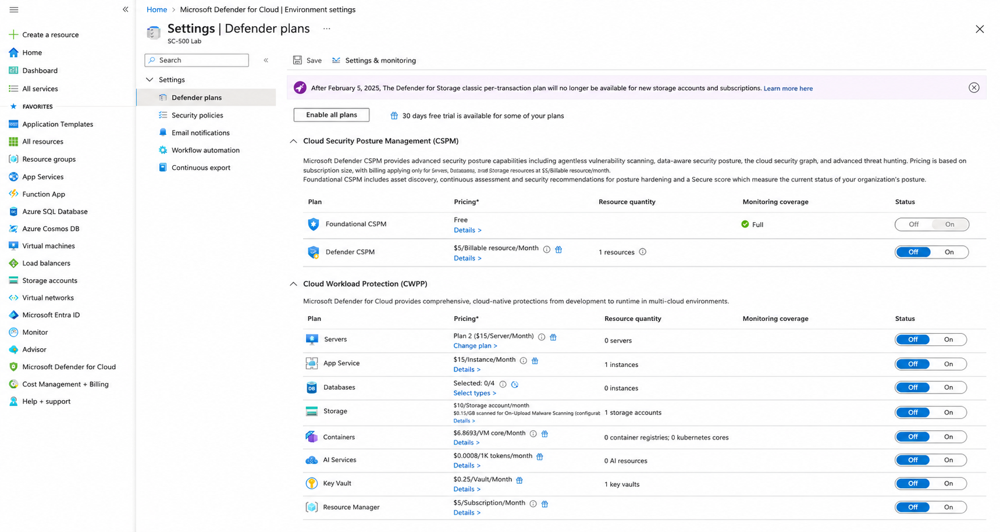
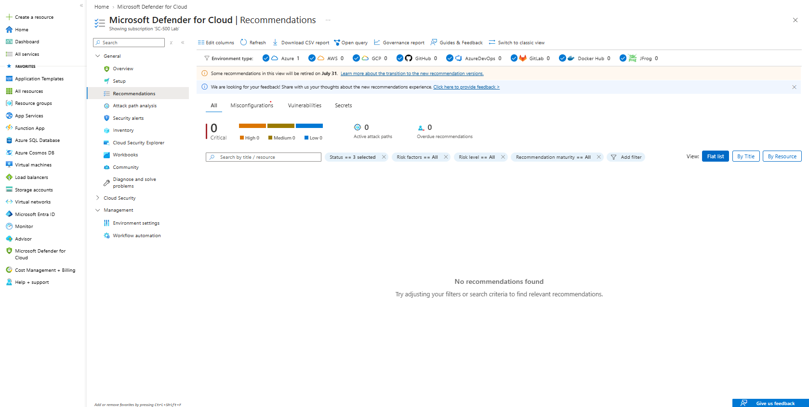

# Lab 08 – Microsoft Defender for Cloud Security Posture

## Objective

Review the security posture capabilities available through Microsoft Defender for Cloud and confirm that Foundational CSPM is enabled for the Azure subscription.

## Resources Used

- Microsoft Defender for Cloud
- Foundational CSPM
- Secure Score
- Security recommendations
- Azure subscription

## What I Reviewed

1. Opened Microsoft Defender for Cloud.
2. Reviewed the subscription environment settings.
3. Confirmed that Foundational CSPM was enabled.
4. Confirmed that the plan was operating with free pricing and full monitoring coverage.
5. Kept the paid Defender CSPM and workload protection plans disabled.
6. Opened the Recommendations page and checked all recommendation statuses.

## Defender for Cloud Configuration

- **Subscription:** `SC-500 Lab`
- **Foundational CSPM:** Enabled
- **Pricing:** Free
- **Monitoring coverage:** Full
- **Defender CSPM:** Disabled
- **Paid workload protection plans:** Disabled

## Security Posture Concept

Microsoft Defender for Cloud continuously assesses Azure resources against security controls and generates:

- Secure Score
- Security recommendations
- Resource health findings
- Cloud security posture insights

Foundational CSPM provides the basic posture-management capabilities without requiring the paid Defender CSPM plan.

## Current Assessment Status

At the time of this lab, Defender for Cloud had not yet completed its initial assessment of the newly created resources.

The Recommendations page showed no results even though all status filters were selected.

Because no recommendation was available, no remediation was performed during this lab.

## Screenshots

### 1. Foundational CSPM Enabled

### 2. Recommendations Assessment Pending

## Outcome

Foundational CSPM was confirmed as enabled with free full monitoring coverage.

The subscription was successfully onboarded to Microsoft Defender for Cloud, but the initial security assessment was still pending at the time of documentation.
