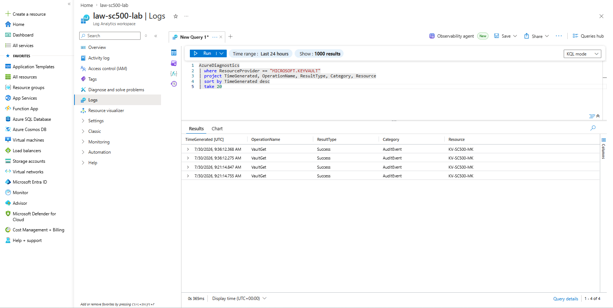
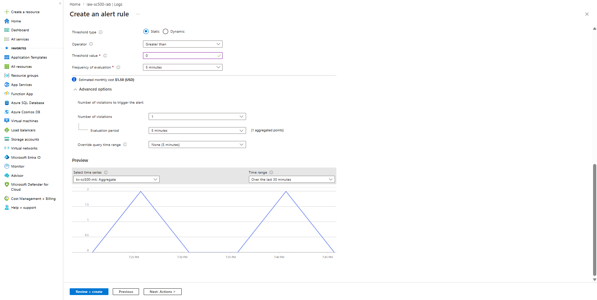

# Lab 09 – Log Analytics, Diagnostic Settings and Alert Design

## Objective

Configure Azure Key Vault diagnostic logging, send audit events to a Log Analytics workspace, query the collected logs using KQL, and design an alert rule for Key Vault activity.

## Resources Used

- Azure Key Vault
- Azure Monitor
- Diagnostic settings
- Log Analytics workspace
- Kusto Query Language (KQL)
- Azure Monitor alerts

## What I Implemented

1. Created a Log Analytics workspace named `law-sc500-lab`.
2. Configured diagnostic settings on `kv-sc500-MK`.
3. Enabled Key Vault audit logging.
4. Sent the logs to the Log Analytics workspace.
5. Generated Key Vault activity.
6. Queried the collected audit events using KQL.
7. Confirmed that successful Key Vault events were being ingested.
8. Designed a scheduled query alert for Key Vault audit activity.

## Diagnostic Configuration

- **Diagnostic setting:** `kv-to-log-analytics`
- **Resource:** `kv-sc500-MK`
- **Log category:** `Audit Logs`
- **Destination:** `law-sc500-lab`
- **Region:** `Australia East`
## KQL Query

```kusto
AzureDiagnostics
| where ResourceProvider == "MICROSOFT.KEYVAULT"
| project TimeGenerated, OperationName, ResultType, Category, Resource
| sort by TimeGenerated desc
| take 20
```

## Screenshots

### 1. Key Vault Diagnostic Settings


### 2. Key Vault Audit Logs



### 3. Key Vault Alert Rule Design




